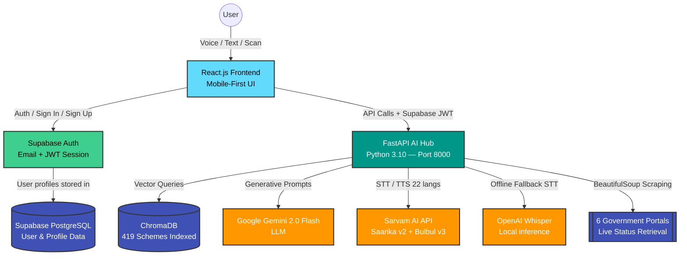

<div align="center">
  <h1>🏛️ Yojna Setu</h1>
  <h3>AI-Powered Government Scheme Assistant</h3>
  <p><b>"Connecting Citizens to their Rights — Jan Jan ko Yojana se Jodo 🇮🇳"</b></p>
  
  <p>
    <a href="https://github.com/RudyMontoo/Yojna_Setu/issues">
      
    </a>
    <a href="https://python.org">
      
    </a>
    <a href="https://fastapi.tiangolo.com/">
      
    </a>
    <a href="https://react.dev">
      
    </a>
  </p>
  <p>
    
    
  </p>
</div>

---

## 📖 Table of Contents
1. [What is Yojna Setu?](#-what-is-yojna-setu)
2. [System Architecture](#-system-architecture)
3. [Key Features](#-key-features)
4. [Tech Stack](#-tech-stack)
5. [Getting Started](#-getting-started)
6. [API Endpoints](#-api-endpoints)
7. [Team](#-team)

---

## 🌟 What is Yojna Setu?

Thousands of government schemes exist, but most citizens never access them due to **complex portals**, **language barriers**, and **lack of awareness**. 

**Yojna Setu bridges that gap** by providing an highly-accessible, conversational AI interface. Whether the user speaks Hindi, Bengali, or Marathi, our AI assistant evaluates their profile, recommends the exact schemes they are eligible for, and checks their live application status.

- 🗣️ **Voice-first interaction** — *No typing needed.*
- 🌐 **Nationwide Coverage** — *Supports 22 Indian languages.*
- 🤖 **Adaptive AI Interview** — *Step-by-step dynamic eligibility matching.*
- 🔒 **Privacy-first Platform** — *Zero PII retention.*

---

## 🏗️ System Architecture



---

## ✨ Key Features

### 1. 🤖 Yojna Sathi — Conversational Eligibility Agent
An adaptive, multi-turn interview that builds a dynamic profile to recommend the best schemes.
- Understands natural Hinglish (e.g., *"mere paas nahi hai"* → mapped to boolean logic).
- Re-ranks schemes 3× by dynamic eligibility score (0–100).
- Auto-generates document checklists for Common Service Center (CSC) visits.

### 2. 🎙️ Bidirectional Voice Pipeline
Total hands-free experience tailored for Indian dialects.
- **Auto-State Detection:** Detects user's state to pick the correct regional language & voice actor.
- **Primary STT/TTS:** Sarvam Saarika v2 & Bulbul v3 APIs.
- **Fail-safe Mode:** Automatically switches to locally hosted OpenAI Whisper models if APIs go down.

### 3. 💬 Low-Latency RAG Chatbot
Type or speak any problem in plain language.
- Powered by **Google Gemini 2.0 Flash** + **ChromaDB** with `all-MiniLM-L6-v2` embeddings.
- Maintains strict conversational session memory via `langchain_core`.
- Streaming endpoints allow tokens to stream natively to the frontend.

### 4. 🛰️ Live Status Tracker
Real-time application status dynamically scraped from active portals rather than caching stale data.
- Built-in 3x retry mechanism with **exponential backoff**.
- Supports 6 major portals including PM Kisan, MGNREGS, and Ayushman Bharat.

### 5. 🛡️ PII Masker (Privacy Guard)
Automatically intercepts Prompts before reaching the LLM and masks sensitive entities utilizing fast Regex sanitization (`Aadhaar`, `PAN`, `Phone Numbers`).

### 6. 📷 Jan-Sahayak Lens (OCR)
Zero-retention, memory-only document scanner utilizing **PaddleOCR CNN pipelines** and **OpenCV** (Auto-deskew, warping, adaptive thresholding) to pull document constraints.

---

## 🛠️ Tech Stack

<details open>
<summary><b>Click to expand</b></summary>

| Category | Technology |
|----------|-----------|
| **Frontend UI** | React 18, Vite, Vanilla CSS (Glassmorphism design) |
| **Authentication** | Supabase Auth (Email/Password + JWT session management) |
| **User Database** | Supabase PostgreSQL (user profiles, onboarding data) |
| **AI Backend** | FastAPI (Python 3.10+) |
| **LLM Engine** | Google Gemini 2.0 Flash via LangChain |
| **Vector Database** | ChromaDB, `all-MiniLM-L6-v2` embeddings (local) |
| **Vision/OCR** | EasyOCR, OpenCV preprocessing |
| **Audio/Voice** | Sarvam AI (Saarika v2 STT, Bulbul v3 TTS), OpenAI Whisper (offline fallback), gTTS |
| **Web Scraping** | BeautifulSoup4 + Requests (3× exponential retry) |
| **API Security** | X-API-Key header auth, per-IP sliding-window rate limiting |

</details>

---

## 🚀 Getting Started

### Prerequisites
- Node.js v18+ (For Frontend)
- Python 3.10+ (For AI Service)
- NVIDIA GPU recommended for local Whisper fallback

### 1. Configure the AI Engine (Backend)

```bash
# Clone the repository
git clone https://github.com/RudyMontoo/SchemeSeekers.git
cd SchemeSeekers

# Navigate to the AI Service and install Python dependencies
cd ai_service
pip install -r requirements.txt

# Setup Environment Keys
cp .env.example .env
```

Ensure your `ai_service/.env` contains:
```env
GEMINI_API_KEY=your_gemini_api_key
SARVAM_API_KEY=your_sarvam_api_key   # Optional but heavily recommended
WHISPER_MODEL=base
INTERNAL_API_KEY=your-random-secret  # generate: openssl rand -hex 32
```

**Run the Backend:**
```bash
# Embed 419 schemes into local ChromaDB
python ingest.py

# Start the uvicorn server
uvicorn main:app --reload --port 8000
```
> API Docs available at `http://localhost:8000/docs`

### 2. Configure the UI (Frontend)

```bash
# Open a new terminal from the project root
cd frontend

# Install Node dependencies
npm install

**Start the development server:**
```bash
npm run dev
```
> Frontend available at `http://localhost:5173`
> Authentication handled automatically by Supabase.

---

## 📡 API Endpoints 

<details>
<summary><b>View Complete API Reference</b></summary>

| HTTP Method | API Endpoint | Description |
|--------|----------|-------------|
| `GET` | `/health` | Diagnostic status (ChromaDB count, DB state, LLM validation) |
| `POST` | `/chat/` | RAG Chatbot with conversation memory |
| `POST` | `/chat/stream` | Stream generated tokens directly |
| `POST` | `/agent/start` | Start eligibility interview |
| `POST` | `/agent/answer` | Provide interview answers to AI Agent |
| `GET` | `/agent/checklist` | Request physical document list |
| `POST` | `/voice/query` | Translate Voice mp3 -> Text -> RAG Query -> Voice MP3 |
| `POST` | `/status/check` | Fetch Live Scraped Status from portals |
| `POST` | `/ocr/scan` | Zero-retention document processing |

</details>

---

## 👥 Team & Architecture Roles

| Member | Focus / Role |
|--------|------|
| **Rudra (AI/ML Lead)** | FastAPI AI Hub, LangChain RAG & Memory, Agent Pipeline, Sarvam/Whisper STT/TTS, PII Masker, Web Scraping, API Security |
| **Member 2** | Spring Boot API Gateway *(parked — future migration)*, JWT Architecture |
| **Member 3** | Flask OCR Worker, EasyOCR/PaddleOCR Integration, External Maps APIs |
| **Member 4** | React Frontend, Supabase Auth Integration, Responsive Design System, Camera/Mic hooks |

---

<div align="center">
  <p><i>This project is built for social good. All data is sourced directly from verifiable Indian government public portals.</i></p>
  <p><b>MSE-2 Evaluated Project</b></p>
</div>
